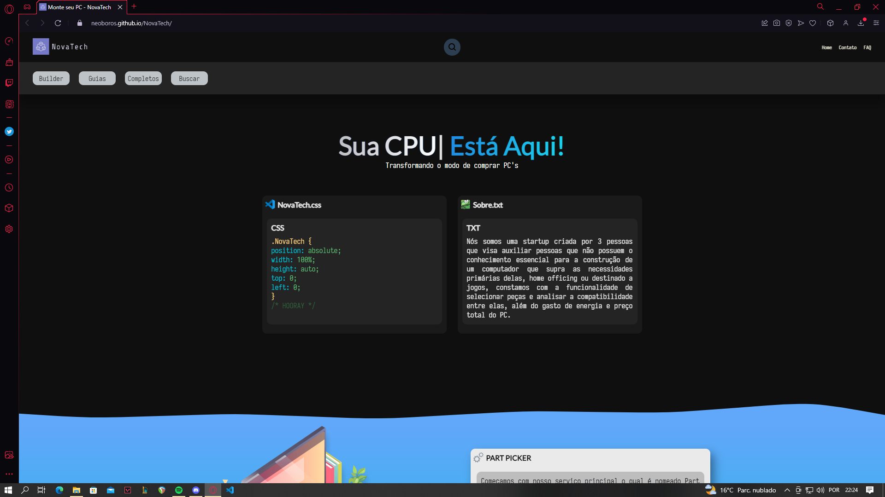

  
  
  

# 🎩 NovaTech:

A NovaTech é uma startup que permite você criar seu computador peça-a-peça, disponibilizando o orçamento, gasto de energia, problemas de compatibilidade entre as peças e ainda por cima realiza uma comparação de preço entre as lojas de informática.

O site está totalmente em português para suprir a necessidade de serviços como esse no Brasil.

# Andamento do Projeto:

<a href="https://neoboros.github.io/NovaTech/"><b>GitHub Pages</b></a>

Atualmente o <a href="https://docs.google.com/presentation/d/147pI2Q5RVeW5FYx99FEYvBMpcv1p3xx_oscBhq9rR3M/edit?usp=sharing"><b>projeto</b></a> encontra-se em seu início, com apenas a home page completa, em desenvolvimento estão a feature builder do website e o <a href="https://github.com/Neoboros/Nova-Bot"><b>DiscordBot</b></a>: 

